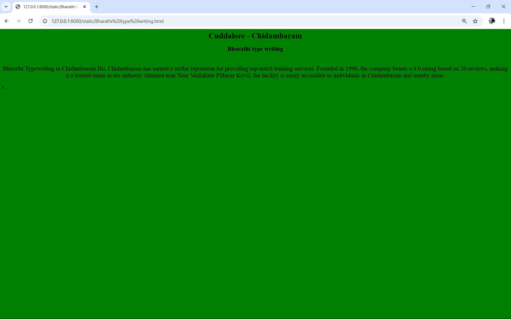

# Ex04 Places Around Me
## Date: 01/12/2024

## AIM
To develop a website to display details about the places around my house.

## DESIGN STEPS

### STEP 1
Create a Django admin interface.

### STEP 2
Download your city map from Google.

### STEP 3
Using ```<map>``` tag name the map.

### STEP 4
Create clickable regions in the image using ```<area>``` tag.

### STEP 5
Write HTML programs for all the regions identified.

### STEP 6
Execute the programs and publish them.

## CODE
```
map.html

<html>
<head>
<title>My City</title>
</head>
<body>
    <h1 aligen="center"
<font align="center" color="red"><b>Cuddalore - Chidambaram</b></font>
</h1>
<h2 align="center">
    <font color="black"><b>Dr.A.P.Jones BEnedict(24900206)</b></font>
</h2>
<center>

<map name="image-map">
    <area target="" alt="Thillai bags" title="Thillai bags" href="Thillai bags.html" coords="352,573,101" shape="circle">
    <area target="" alt="Kannagi fabric works" title="Kannagi fabric works" href="Kannagi fabric works.html" coords="841,605,1066,710" shape="rect">
    <area target="" alt="Bharathi type writing" title="Bharathi type writing" href="Bharathi type writing.html" coords="327,43,504,122" shape="rect">
    <area target="" alt="Abi medicals" title="Abi medicals" href="Abi medicals.html" coords="626,149,86" shape="circle">
    <area target="" alt="Om muruga tower" title="Om muruga tower" href="Om muruga tower.html" coords="553,618,754,703" shape="rect">
</map>
</center>
</body>
</html>

abi.html

<html>
    <head>
        <title></title>
    </head>
    <body bgcolor="red">
        <font><h1 align="center">Cuddalore - Chidambaram</h1></font>
        <h2 align="center">Abi medicals</h2>
        <font align="center" size="5"><p>
            <br>
            The Abi sri medicals in Chidambaram ho,Chidambaramis a dedicated pharmacy that provides a wide range of medicals needs, including chemists.the pharmacy is rated 4.5.
        </p></font>
    </body>
</html>

bharathi.html

<html>
    <head>
        <title></title>
    </head>
    <body bgcolor="green">
        <font><h1 align="center">Cuddalore - Chidambaram</h1></font>
        <h2 align="center">Bharathi type writing</h2>
        <font align="center" size="5"><p>
            <br>
            
Bharathi Typewriting in Chidambaram Ho, Chidambaram has earned a stellar reputation for
providing top-notch training services. Founded in 1990, the company boasts a 4.0 rating based on
20 reviews, making it a trusted name in the industry. Situated near Near Vazhikatti Pillayar Kovil, the
facility is easily accessible to individuals in Chidambaram and nearby areas.
        </p></font>
    </body>
</html>

kannagi.html

<html>
    <head>
        <title></title>
    </head>
    <body bgcolor="brown">
        <font><h1 align="center">Cuddalore - Chidambaram</h1></font>
        <h2 align="center">Kannagi Fabrics</h2>
        <font align="center" size="5"><p>
            <br>
            Kannagi Engineering & Fabrication Works is located in Chidambaram East, Cuddalore. Currently we do not have any reviews or rating for Kannagi Engineering & Fabrication Works. There are at least 1 Metal working shops in Chidambaram East, out of which this Metal working shop has an overall rank of 1. Kannagi Engineering & Fabrication Works has a website https://kannagi-engineering-fabrication-works.business.site/?utm_source=gmb&utm_medium=referral. Address of the Metal working shop is Lalpet, Street, Chidambaram, Tamil Nadu 608001.
        </p></font>
    </body>
</html>

om.html

<html>
    <head>
        <title></title>
    </head>
    <body bgcolor="Lightgrey">
        <font><h1 align="center">Cuddalore - Chidambaram</h1></font>
        <h2 align="center">Om Muruga Tower</h2>
        <font align="center" size="5"><p>
            <br>
            As om muruga tower is a apartment located in somasundarar street Chidambaram.the appartment have many facilities like car parking,lift,cctv camera,peaceful and silent place. 
        </p></font>
    </body>
</html>

thillai.html

<html>
    <head>
        <title></title>
    </head>
    <body bgcolor="purple">
        <font><h1 align="center">Cuddalore - Chidambaram</h1></font>
        <h2 align="center">Thillai bags</h2>
        <font align="center" size="5"><p>
            <br> 
            Established in the year 2011, Sri Thillai Bags (Closed Down) in Sengottan Street, Chidambaram is a top player in the category in the Chidambaram. This well- known establishment acts as a one-stop destination servicing customers both local and from other parts of Chidambaram. Over the course of its journey, this business has established a firm foothold in it's industry. The belief that customer satisfaction is as important as their products and services, have helped this establishment garner a vast base of customers, which continues to grow by the day. This business employs individuals that are dedicated towards their respective roles and put in a lot of effort to achieve the common vision and larger goals of the company. In the near future, this business aims to expand its line of products and services and cater to a larger client base. In Chidambaram, this establishment occupies a prominent location in Sengottan Street. It is an effortless task in commuting to this establishment as there are various modes of transport readily available.
        </p></font>
    </body>
</html>

```

## OUTPUT





## RESULT
The program for implementing image maps using HTML is executed successfully.
